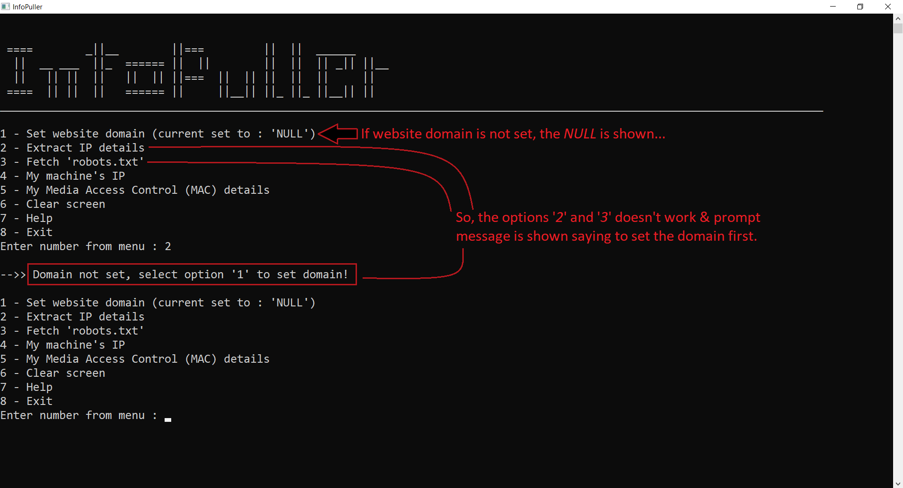

# InfoPuller
Menu driven <a href="https://en.wikipedia.org/wiki/Command-line_interface">CLI</a> application that can get basic details for given website domain or local machine. It also has basic persistence similar to malware or threat. It's a personal study project... 🙂

<h2><u>Features overview</u> :</h2>

<u><i>Visible</i></u> key features :  

- Extract all of the available <a href="https://en.wikipedia.org/wiki/IPv4">IPv4</a> and <a href="https://en.wikipedia.org/wiki/IPv6">IPv6</a> addresses for given website.
- Fetch response <a href="https://developers.google.com/search/docs/advanced/robots/intro">robots.txt</a> for given website, then save and/or show.
- Extract local machine's available IPv4 and IPv6 addresses.
- Extract <a href="https://en.wikipedia.org/wiki/MAC_address">Media Access Control (MAC)</a> details for local machine, either in <i>basic</i> or in <i>detailed</i> form.

<u><i>Hidden</i></u> key features :  

- The application copies itself to other place and becomes hidden.
- Makes changes in Windows registry to autostart things after every system startup.

<h2><u><a href="https://docs.microsoft.com/en-us/windows/win32/api/">Win32</a> API headers</u> :</h2>

<ol>
    <li>
        <a href="https://en.wikipedia.org/wiki/Windows.h">Windows.h</a> - A Windows-specific header file for the C and C++ programming languages which contains declarations for all of the functions in the Windows API.
    </li>
    <li>
        <a href="https://en.wikipedia.org/wiki/C_file_input/output">stdio.h</a> - Provides many standard library functions for input and output.
    </li>
    <li>
        <a href="https://en.wikipedia.org/wiki/C_standard_library">stdlib.h</a> - Provides macros, type definitions and functions for tasks such as string handling, mathematical computations, input/output processing, memory management, and several other operating system services.
    </li>
    <li>
        <a href="https://docs.microsoft.com/en-us/windows/win32/api/fileapi/">fileapi.h</a> - Used for Data Access and Storage.
    </li>
    <li>
        <a href="https://docs.microsoft.com/en-us/windows/win32/api/winsock2/">WinSock2.h</a> - Provides useful functions for network programming such as sockets, IP addresses and so on. It is used by <a href="https://docs.microsoft.com/en-us/windows/win32/api/_qos/">Quality of Service (QOS)</a>.
    </li>
    <li>
        <a href="https://docs.microsoft.com/en-us/windows/win32/api/wininet/">WinInet.h</a> - To handle files over FTP/HTTP URL.
    </li>
    <li>
        <a href="https://docs.microsoft.com/en-us/windows/win32/api/ws2tcpip/">WS2tcpip.h</a> - WinSock2 Protocol-Specific Annex document for TCP/IP that includes newer functions and structures used to retrieve IP addresses.
    </li>
    <li>
        <a href="https://docs.microsoft.com/en-us/windows/win32/api/iphlpapi/">iphlpapi.h</a> - Provides functions to get <a href=https://en.wikipedia.org/wiki/MAC_address">MAC address</a> details.
    </li>
</ol>

<h2><u>Features in detail</u> :</h2>

<h3>{🌟} <u><i>Visible</i></u> key features : </h3>

  <h3><b>1. Set website domain :</b></h3>
  <ul> 
    <li>
        When application is launched, the console window will opened and gets auto-maximized containing some fancy text representing the name of application with few numbered menu options to choose from :  
        

    </li>
    <li>
        To get information about website, first set the domain using option '<b>1</b>' (the domain should be in form of <i><a href="http://www.example.com/">www.example.com</a></i> or <i><a href="http://www.example.com/">example.com</a></i>) :  
        

    </li>
    <li>
        Now the website domain is all set; the other related menu options also get reflected :  
        

    </li>
    <li>
        Setting the website domain is essential to get results otherwise one can not use menu options '<b>2</b>' and '<b>3</b>' related to website domains :  
        

    </li>
    <li>
        Providing <i>empty</i> input will clear the domain that is set previously :  
        

        

    </li>
  </ul>

  <h3><b>2. Extract IP details :</b></h3>
  <ul>
    <li>
        If the website domain set properly, program will list of all available IPv4 and IPv6 addresses :  
        

    </li>
    <li>
        If any of IPv4 or IPv6 is not available, then useful message with related error code is returned :  
        

        - Functions used :  
        <a href="https://docs.microsoft.com/en-us/windows/win32/api/ws2tcpip/nf-ws2tcpip-getaddrinfo">getaddrinfo()</a>,
        <a href="https://docs.microsoft.com/en-us/windows/win32/api/ws2tcpip/nf-ws2tcpip-inet_ntop">inet_ntop()</a>.
    </li>
  </ul>

  <h3><b>3. Fetch 'robots.txt' :</b></h3>
  <ul>
    <li>
        Based on the website domain, the program will try to get contents of 'robots.txt' and will ask user to choose either save (S) or print (p) :  
        

    </li>
    <li>
        If user opted to save (S), program will save the response content in uniquely generated TEMP file and again will ask whether to view saved file in notepad (by creating separate process) :  
        

        

        
<i>The file opened in notepad as a separate process.</i>

    </li>
    <li>
        If user opted to print (p), program will print the response content in console :  
        

        - Functions used :  
        <a href="https://docs.microsoft.com/en-us/windows/win32/api/wininet/nf-wininet-internetopena">InternetOpenA()</a>,
        <a href="https://docs.microsoft.com/en-us/windows/win32/api/wininet/nf-wininet-internetopenurla">InternetOpenUrlA()</a>,
        <a href="https://docs.microsoft.com/en-us/windows/win32/api/wininet/nf-wininet-internetclosehandle">InternetCloseHandle()</a>,
        <a href="https://docs.microsoft.com/en-us/windows/win32/api/fileapi/nf-fileapi-gettemppatha">GetTempPathA()</a>,
        <a href="https://docs.microsoft.com/en-us/windows/win32/api/fileapi/nf-fileapi-gettempfilenamea">GetTempFileNameA()</a>,
        <a href="https://docs.microsoft.com/en-us/windows/win32/api/fileapi/nf-fileapi-createfilea">CreateFileA()</a>,
        <a href="https://docs.microsoft.com/en-us/windows/win32/api/wininet/nf-wininet-internetreadfile">InternetReadFile()</a>,
        <a href="https://docs.microsoft.com/en-us/windows/win32/api/fileapi/nf-fileapi-writefile">WriteFile()</a>,
        <a href="https://docs.microsoft.com/en-us/windows/win32/api/handleapi/nf-handleapi-closehandle">CloseHandle()</a>,
        <a href="https://docs.microsoft.com/en-us/windows/win32/api/wininet/nf-wininet-internetclosehandle">InternetCloseHandle()</a>,
        <a href="https://docs.microsoft.com/en-us/windows/win32/api/processthreadsapi/nf-processthreadsapi-createprocessa">CreateProcessA()</a>.
    </li>
  </ul>

  <h3><b>4. My machine's IP :</b></h3>
  <ul>
    <li>
        Shows the available IPv4 and IPv6 for the local machine. Here the IP addresses mostly contain collection of local and global addresses :  
        

        - Functions used :  
        <a href="https://docs.microsoft.com/en-us/windows/win32/api/ws2tcpip/nf-ws2tcpip-getaddrinfo">getaddrinfo()</a>,
        <a href="https://docs.microsoft.com/en-us/windows/win32/api/ws2tcpip/nf-ws2tcpip-inet_ntop">inet_ntop()</a>.
    </li>
  </ul>

  <h3><b>5. My Media Access Control (MAC) details :</b></h3>
  <ul>
    <li>
        Shows the <a href="https://en.wikipedia.org/wiki/MAC_address">Media Access Control (MAC)</a> details for local machine. It offers to choose either basic (B) or detailed (d).   
        The <i>basic mode</i> is similar to the command <b><i><u>ipconfig /all</u></i></b> and the detailed mode performs extensive searching and provide hardware details including the adapters created by virtualization softwares :  
        

        - Functions used :  
        <a href="https://docs.microsoft.com/en-us/windows/win32/api/heapapi/nf-heapapi-heapalloc">HeapAlloc()</a>,
        <a href="https://docs.microsoft.com/en-us/windows/win32/api/iphlpapi/nf-iphlpapi-getadaptersaddresses">GetAdaptersAddresses()</a>,
        <a href="https://docs.microsoft.com/en-us/windows/win32/api/heapapi/nf-heapapi-heapfree">HeapFree()</a>,
        <a href="https://docs.microsoft.com/en-us/windows/win32/api/heapapi/nf-heapapi-getprocessheap">GetProcessHeap()</a>.
    </li>
  </ul>

<h3>{🌟} <u><i>Hidden</i></u> key features : </h3>

  <h3><b>1. Copy application and make hidden :</b></h3>
  <ul>
    <li>
        As soon as the application launched, it checks and creates a copy of itself at TEMP path and make it hidden in order to keep a persistence :
        

        - Functions used :  
        <a href="https://docs.microsoft.com/en-us/windows/win32/api/fileapi/nf-fileapi-gettemppatha">GetTempPathA()</a>,
        <a href="https://docs.microsoft.com/en-us/windows/win32/api/winbase/nf-winbase-copyfilea">CopyFileA()</a>,
        <a href="https://docs.microsoft.com/en-us/windows/win32/api/fileapi/nf-fileapi-getfileattributesa">GetFileAttributesA()</a>,
        <a href="https://docs.microsoft.com/en-us/windows/win32/api/fileapi/nf-fileapi-setfileattributesa">SetFileAttributesA()</a>.
    </li>
  </ul>

  <h3><b>2. Change Windows registry for autostart :</b></h3>
  <ul>
    <li>
        Application adds some entries in Windows registry to autostart itself alongwith calculator and a text file saved as hidden at TEMP location :  
        

        - Functions used :  
        <a href="https://docs.microsoft.com/en-us/windows/win32/api/winreg/nf-winreg-regopencurrentuser">RegOpenCurrentUser()</a>,
        <a href="https://docs.microsoft.com/en-us/windows/win32/api/winreg/nf-winreg-regsetkeyvaluea">RegSetKeyValueA()</a>,
        <a href="https://docs.microsoft.com/en-us/windows/win32/api/fileapi/nf-fileapi-gettemppatha">GetTempPathA()</a>,
        <a href="https://docs.microsoft.com/en-us/windows/win32/api/fileapi/nf-fileapi-createfilea">CreateFileA()</a>,
        <a href="https://docs.microsoft.com/en-us/windows/win32/api/fileapi/nf-fileapi-writefile">WriteFile()</a>,
        <a href="https://docs.microsoft.com/en-us/windows/win32/api/handleapi/nf-handleapi-closehandle">CloseHandle()</a>,
        <a href="https://docs.microsoft.com/en-us/windows/win32/api/winreg/nf-winreg-regclosekey">RegCloseKey()</a>.
    </li>
  </ul>

 
- Other functions used :  
<a href="https://docs.microsoft.com/en-us/windows/win32/api/winsock2/nf-winsock2-wsastartup">WSAStartup()</a>,
<a href="https://docs.microsoft.com/en-us/windows/win32/api/winsock2/nf-winsock2-wsacleanup">WSACleanup()</a>,
<a href="https://docs.microsoft.com/en-us/windows/console/setconsoletitle">SetConsoleTitleA()</a>,
<a href="https://docs.microsoft.com/en-us/windows-hardware/drivers/ddi/wdm/nf-wdm-rtlsecurezeromemory">SecureZeroMemory() (or RtlSecureZeroMemory())</a>,
<a href="https://docs.microsoft.com/en-us/windows/win32/api/winuser/nf-winuser-findwindowa">FindWindowA()</a>,
<a href="https://docs.microsoft.com/en-us/windows/win32/api/winuser/nf-winuser-showwindow">ShowWindow()</a>,
<a href="https://docs.microsoft.com/en-us/windows/win32/api/winuser/nf-winuser-setforegroundwindow">SetForegroundWindow()</a>.

 
<h2><u>NOTE</u> :</h2>
As listed in <i>hidden features</i> above, application uses core Windows OS headers and to avoid its use for malicious purposes, the code is not open sourced; instead the executable is provided.   
